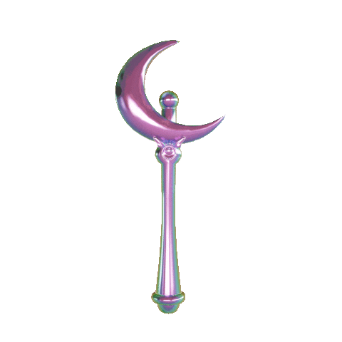

<h3>𝖂𝖊𝖑𝖈𝖔𝖒𝖊 𝖙𝖔 𝖒𝖞 𝖌𝖎𝖙𝖍𝖚𝖇 𝖕𝖗𝖔𝖋𝖎𝖑𝖊</h3>

 

<table align="center">
  <tr>
    <th></th>
    <th></th>
    <th></th>
  </tr>
  <tr>
    <td><a href="https://rdwei.github.io/">Personal Website</a></td>
    <td><a href="https://rdwei.github.io/last">Last Post</a></td>
    <td><a href="https://www.instagram.com/rdwe_i/">Instagram</a></td>
  </tr>
</table>

   

   

| My Project                                                                 | Description                                        |
|:---------------------------------------------------------------------------|:---------------------------------------------------|
| [C-rypt](https://github.com/rdWei/C-rypt)                                  | 🖼️ GUI Steganography tool entirely written in C    |
| [mousice](https://github.com/rdWei/mousice)                                | 🎶 Suckless CLI YouTube-Music Player               |
| [DiscDoor](https://github.com/rdWei/DiscDoor)                              | 🔓 An Easy-to-Use Discord-Based Backdoor Tool      |
| [LawLiet](https://github.com/rdWei/Lawliet)                                | 🕵️ Find social media profiles by username across platforms |
| [ExaPhisher](https://github.com/rdWei/exaPhisher)                          | 🐟 Social Media Phishing Suite written in python & php |
| [OsintTube](https://github.com/rdWei/OsintTube)                            | 🔍 An Easy-to-Use YouTube OSINT Tool              |
| [SocialMediaHackingToolkit](https://github.com/rdWei/SocialMediaHackingToolkit) | 🔒 Social Media Hacking Suite - Archived          |
| [UMusic](https://github.com/rdWei/UMusic)                                  | 🎵 A feature-rich, lightweight PSP music player   |
 
 

  

 

  

<table align="center">
  <tr>
    <th></th>
    <th></th>
  </tr>
  <tr>
    <td><a href="https://discord.gg/3r6mkjv6AP">Discord</a></td>
    <td><a href="https://github.com/rdWei/rdWei/blob/main/donate.MD">Support Me</a></td>
  </tr>
</table>

 

  <i>I'll only respond to those proposals that are a good match for my schedule and interests, thank you.</i>

 

